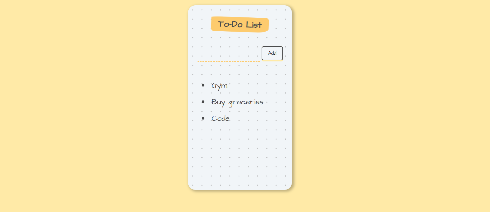

## 📝To-Do List React App 

<p> A clean and simple To-Do List web application built using React.js and Vite. 
Users can add tasks and delete tasks with a smooth and responsive UI.
This project demonstrates core React concepts such as components, props, and state management using the useState hook.</p>

Note:
This version does not store tasks after refresh, i.e., it has no backend or storage implementation.

### **Tech Stack**

<ul>
  <li>React.js</li>
  <li>JavaScript (ES6+)</li>
  <li>Vite</li>
  <li>CSS</li>
</ul>

### **Procedure to run the project locally**

Follow these steps to run the project on your local machine:

**1️⃣ Clone the repository**
```bash
git clone https://github.com/YOUR-USERNAME/YOUR-REPO.git
```
**2️⃣ Navigate into the project folder**
```bash
cd YOUR-REPO
```
**3️⃣ Install dependencies**
```bash
npm install
```

**4️⃣ Start the development server**
```bash
npm run dev
```

**5️⃣ Open the app in your browser**
<p>Visit the local server link shown in the terminal, usually:</p>

```bash
http://localhost:5173/
```

## Preview
<p align="center">

</p>

<br>

*Feel free to fork this repository and improve the app.*
*Pull requests are welcome!*
